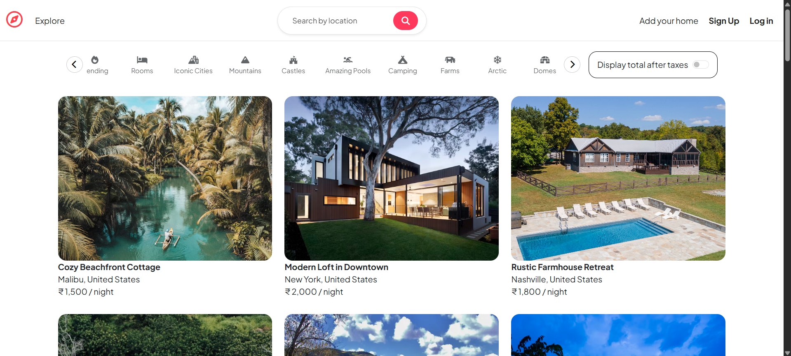
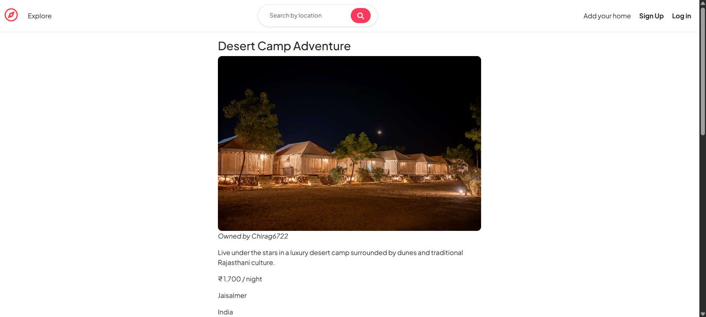
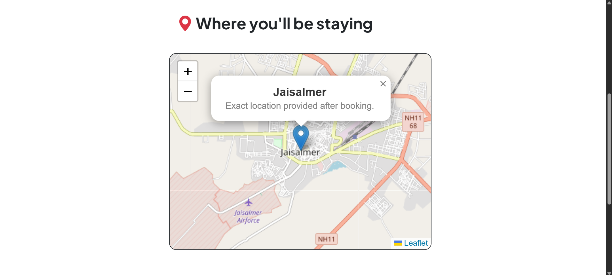
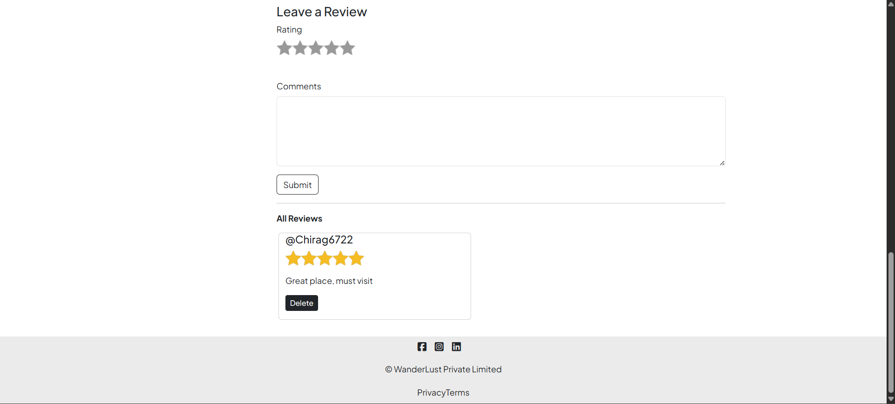

# WanderLust

**Wanderlust** is a full-stack travel stay web application where users can discover unique places to stay, list their own properties, explore locations with interactive maps, leave reviews, and manage listings — all within a seamless, responsive interface. It features integrated authentication, dynamic map views using Leaflet, and a clean, modern UI built with Bootstrap.

---

## Website Link

[Visit WanderLust](https://wanderlust-l8kk.onrender.com/)  

---

## Screenshots

 ### Homepage

### Listing Page

### Map Integration

### Reviews Section

---

## Features

- CRUD operations for listings
- Location-based search (title, description, location, country)
- Leaflet map integration for each listing
- User reviews with star ratings
- User authentication (Login/Signup)
- Only owners can edit/delete their listings
- Image upload with Cloudinary
- Fully responsive (Bootstrap 5)
- MVC architecture followed

---

## Tech Stack

- **Backend**: Node.js, Express.js
- **Frontend**: EJS Templating, Bootstrap 5
- **Database**: MongoDB + Mongoose
- **Maps**: Leaflet.js
- **Cloud Storage**: Cloudinary
- **Authentication**: Passport.js
- **Others**: Express-session, Connect-mongo, Method-override etc

---

 ## Project Structure

- `app.js` – Main application entry point
- `cloudConfig.js` – Cloudinary configuration
- `controllers/` – Route logic for listings and reviews
- `models/` – Mongoose schemas (Listing, Review, User)
- `routes/`
  - `listings.js` – All routes related to listings
  - `reviews.js` – All routes related to reviews
  - `users.js` – Authentication routes
- `middleware.js` – Custom Express middleware
- `utils/`
  - `ExpressError.js` – Error class for clean handling
  - `wrapAsync.js` – Utility to wrap async routes
- `views/` – EJS templates
  - `listings/` – Views for index, show, new, edit
  - `reviews/` – Partial for reviews
  - `users/` – Login and register views
  - `partials/` – Header, footer, alerts
  - `layouts/` – Boilerplate base layout
- `public/`
  - `css/` – Custom styles
  - `js/` – Custom scripts (like map.js)
  - `images/` – Static image assets (if any)

---

## Deployment (Render)

Wanderlust is deployed on [Render](https://render.com)
